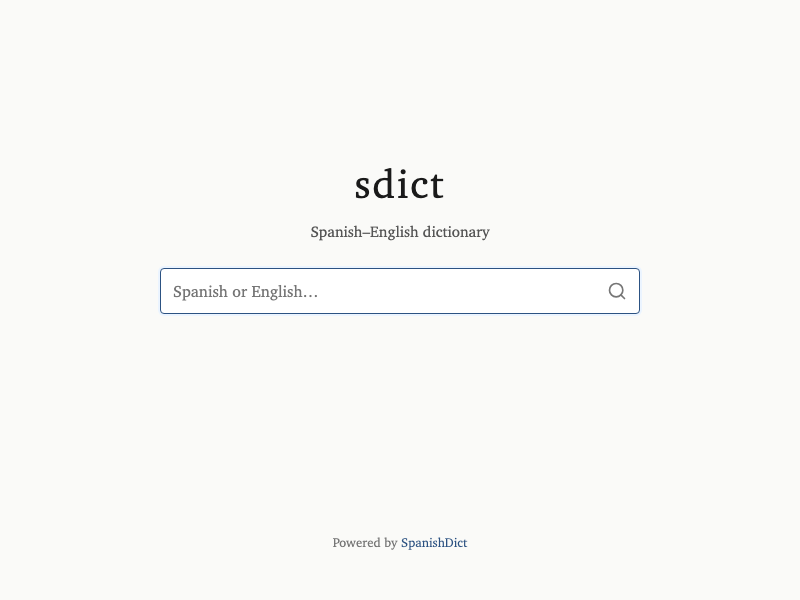
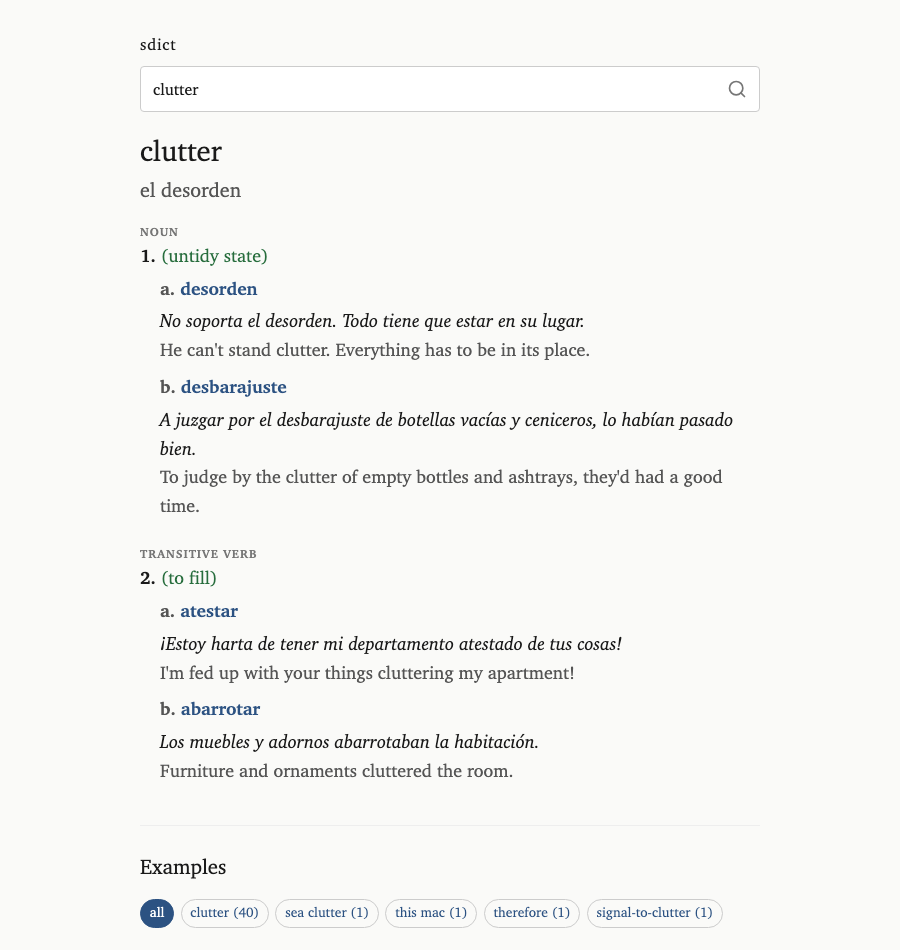
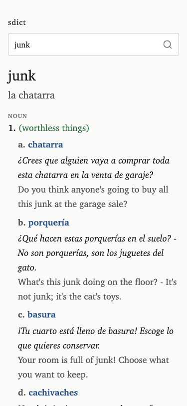

> Dear SpanishDict,
>
> I wish this project didn't have to exist.
> Your dictionary is great, but your UI is a bloated mess of ads, login popups, trackers, and feature nagging.
> Please clean up your site. I'm trying to learn Spanish.
>
> Saludos,
>
> Steve

# sdict

A clutter-free frontend for [SpanishDict](https://www.spanishdict.com/). No ads, no trackers, no JS. Just the dictionary.

<table>
  <tr>
    <td></td>
    <td></td>
    <td></td>
  </tr>
</table>

## Self-host with Docker

```bash
docker run --name sdict -p 3000:3000 ghcr.io/sloria/sdict:latest
```

Or with Docker Compose:

```yaml
services:
  sdict:
    image: ghcr.io/sloria/sdict:latest
    ports:
      - "3000:3000"
```

```bash
docker compose up
```

The image is tiny (~15Mb) and uses very little resources (< 1Mb of RAM) while running.

## Environment variables

All environment variables are optional.

- `PORT` — Port to listen on (default: `3000`)
- `RUST_LOG` — Log level filter (default: `info`)
- `SENTRY_DSN` — Sentry/GlitchTip DSN
- `SENTRY_ENV` — Sentry/GlitchTip environment, e.g. `production`, `staging`

## Development

```bash
# Run the dev server (http://localhost:3000)
mise run start

# Install pre-commit hooks
prek install

# Run tests
cargo test

# Lint
cargo clippy

# Format
cargo fmt
```
